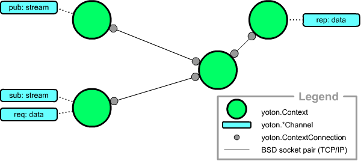
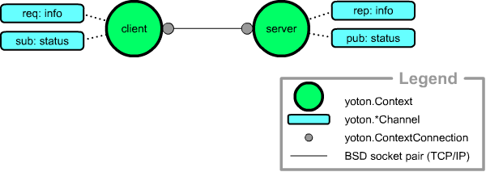
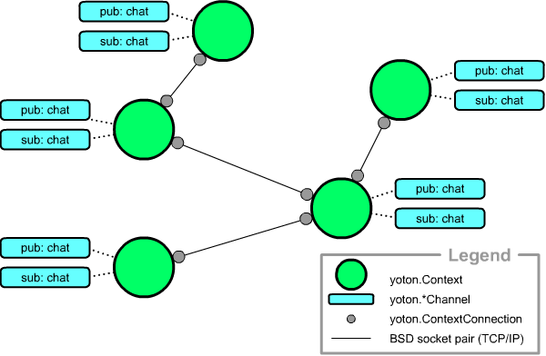
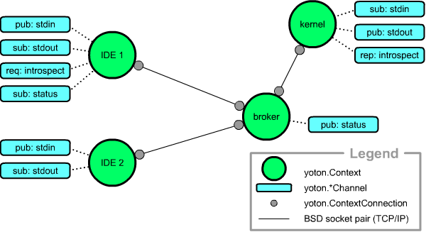

Examples
=========

Abstract example
----------------

This example shows four connected contexts. In principal, all contexts are the same (a context is neither a client nor a server). Yet, different contexts can play different roles in the network, by using different channels:
  * The upper left context publishes a stream of messages.
  * The upper right context employs a reply-channel, thereby taking on a server role. 
  * The bottom left context takes on a client-like role by subscribing to the "stream" channel and by having a request-channel on "data". 
  * The bottom right context has no channels and thus only serves as a means of connecting the different contexts.

Simple client server
----------------------

Two contexts. One takes a server role by having a publish-channel and a reply-channel. The other takes on a client role by deploying the corresponding subscribe-channel and request-channel.

Multiple request/reply
-----------------------

This network contains only two types of context: requesters and repliers. Yoton performs a simple load balancing scheme: when the user posts a request, the req-channel first asks all repliers whether they can want to handle it. Eventually all repliers will answer that they do, but the actual request is only send to the first to respond. Requesters that are handling a previous request are unable to respond quickly so that the request will be handled by a "free" replier automatically. If all requesters are busy, the first to "come back" will handle the request.

.. image:: /images/yoton_multiple_reqrep.png

Chat
------

This network consists of context which all take the same role; they all send chat messages and receive chat messages of the other nodes. One big chat room!

IDE / kernel
-------------

This network illustrates a simplified version of what yoton was initially designed for: client-kernel communication. `IEP <http://www.iep-project.org>`_ uses 
yoton for its kernel-client communications, 
see `here <https://bitbucket.org/iep-project/iep/src/tip/iep/iepkernel/start.py>`_
which channels IEP uses for that. 

The network consists of one kernel and two clients which are connected via a broker. Both clients can control the kernel via an stdin stream and receive output on stdout. The kernel also has a reply-channel so that the IDE's can obtain introspection information (think auto-completion). The broker also publishes some status messages. The bottom kernel is apparently only interested in kernel control.

